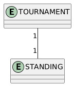
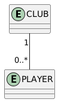
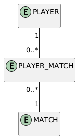
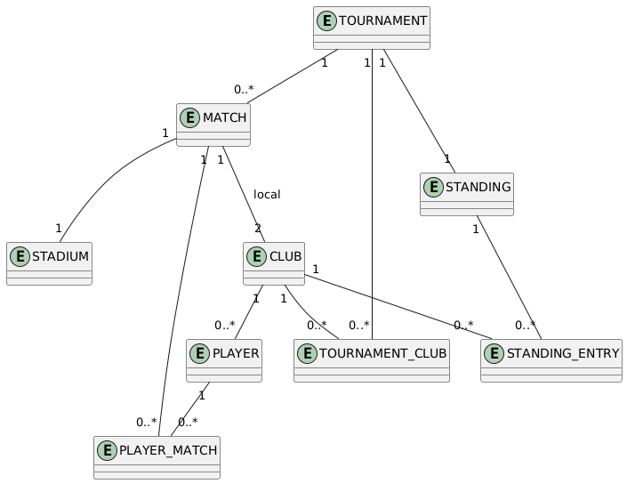

# Base de datos relacionales

## ¿Qué es una base de datos?

Una **base de datos** es un sistema organizado para almacenar, gestionar y recuperar información. Está compuesta por una colección de datos estructurados que pueden consultarse y modificarse mediante un sistema de gestión de base de datos (SGBD).

### Características

- Permite persistencia de datos.
- Soporta consultas complejas para análisis o reportes.
- Asegura integridad y consistencia a través de restricciones (claves primarias, foráneas, etc).
- Permite acceso concurrente y seguro a los datos.

## Paradigma Relacional

El mundo relacional es el paradigma sobre el que se basan los sistemas de gestión de bases de datos relacionales (SGBDR).

### Características principales:

- Modelo tabular: los datos se organizan en tablas (relaciones), con filas (tuplas) y columnas (atributos).
- Integridad referencial mediante claves primarias y foráneas.
- Lenguaje declarativo (SQL).
- Normalización para evitar redundancia.
- Separación entre datos y lógica de negocio.

## Comparación: Paradgima Relacional vs Jerárquico/Objetual

| Característica                     | Mundo Relacional                                     | Mundo Jerárquico/Objetual                            |
|----------------------------------|-----------------------------------------------------|-----------------------------------------------------|
| Unidad base                      | Tabla                                               | Clase                                              |
| Relaciones                       | Por claves foráneas                                 | Composición, asociación, uso                      |
| Acceso a datos                   | Declarativo (SQL)                                   | Imperativo (métodos, navegación)                   |
| Integridad referencial           | Constraints del SGBD                                | Código del sistema                                 |
| Estructura                       | Tablas planas con relaciones                        | Estructura jerárquicas, clases                         |
| Herencia                         | No nativa                                           | Sí, con herencia de clases                         |
| Modelado                         | Entidades y relaciones                              | Clase con atributos y comportamiento                    |

## Tipos de relaciones en bases de datos relacionales

### Uno a Uno (1:1)
Cada registro de una tabla se relaciona con uno y solo uno de otra.

Ejemplo Liga Libre:
- `TOURNAMENT` 1:1 `STANDING`



### Uno a Muchos (1:N)
Un registro en A puede relacionarse con muchos en B, pero B solo con uno en A.

Ejemplos:
- `CLUB` 1:N `PLAYER`
- `TOURNAMENT` 1:N `MATCH`
- `STADIUM` 1:N `MATCH`



### Muchos a Muchos (N:N    )
A muchos en A les corresponde muchos en B. Se usa tabla intermedia.

Ejemplos:
- `TOURNAMENT` N:M `CLUB` → `TOURNAMENT_CLUB`
- `STANDING` N:M `CLUB` → `STANDING_ENTRY`



## DER - Liga Libre

### Clases involucradas:

- Tournament
- Club
- Player
- Match
- Standing
- Stadium

### Relaciones principales:

- `Tournament` tiene múltiples `Match` y `Club`
- `Tournament` tiene un único `Standing`
- `Club` tiene muchos `Player`
- `Match` involucra dos `Club` y se juega en un `Stadium`
- `Standing` contiene posiciones por `Club`




## Conexión entre relaciones entre clases y relaciones entre tablas

Hay una relación conceptual entre los tipos de relaciones entre clases (en diseño orientado a objetos) y los tipos de relaciones entre tablas (en el modelo relacional), pero no es una correspondencia uno a uno exacta.

| Relación entre clases | Relación entre tablas  | Explicación                                                            |
| ----------------- | ---------------------- | -------------------------------------------------------------------------- |
| Asociación        | 1:1, 1\:N o N\:M       | Relación genérica. Dependerá de la multiplicidad definida en la asociación |
| Agregación        | 1\:N                   | Relación "todo-parte", donde la parte puede existir sin el todo            |
| Composición       | 1\:N (con dependencia) | Relación "todo-parte" más fuerte, donde la parte **no existe sin el todo** |
| Uso               |                        | Es una relación **temporal o contextual**, no implica una tabla específica |

### Asociación → 1:1, 1:N, N:N

- Puede derivar en cualquier cardinalidad según la multiplicidad.
- Ejemplo: `MATCH --> STADIUM` → muchos partidos en un mismo estadio → **1:N**

### Agregación → 1:N

- El todo posee partes pero no las controla completamente.
- Ejemplo: `TOURNAMENT ◇--> CLUB` → relación **N:N** con tabla intermedia `TOURNAMENT_CLUB`.

### Composición → 1:N con dependencia

- Las partes **no existen sin el todo**.
- Ejemplo: `TOURNAMENT *-- STANDING` → relación **1:1**, donde `STANDING.tournament_id` es también **PK**.

### Uso → no se modela directamente

- Relación temporal para utilizar métodos o datos.
- No se refleja directamente en la base de datos relacional.


El tipo de relación entre clases orienta la cardinalidad entre tablas, pero no la determina automáticamente.

----

## SQL: Structured Query Language (lenguaje de consulta estructurada)
SQL es un lenguaje estándar para almacenar, manipular y recuperar datos en bases de datos. Permite acceder y manipular bases de datos. Se convirtió en estándar del Instituto Nacional Americano de Estándares (ANSI) en 1986 y de la Organización Internacional de Normalización (ISO) en 1987.

### ¿Qué puede hacer SQL?
- Ejecutar consultas en una base de datos.
- Recuperar datos de una base de datos.
- Insertar registros en una base de datos.
- Actualizar registros en una base de datos.
- Eliminar registros de una base de datos.
- Crear nuevas bases de datos.
- Crear nuevas tablas en una base de datos.
- Crear procedimientos almacenados en una base de datos.
- Crear vistas en una base de datos.
- Establecer permisos en tablas, procedimientos y vistas.


### Organización de la información en SQL

##### 1. Base de datos (Database)

Es la unidad principal de almacenamiento. Dentro de una base de datos se encuentran todos los objetos necesarios para almacenar y manipular la información.

```sql
CREATE DATABASE LigaLibre;
```

##### 2. Esquemas (Schemas)
Un esquema es un contenedor lógico que agrupa objetos (tablas, vistas, procedimientos) dentro de una base de datos. Ayuda a organizar la información y a separar responsabilidades. Esta agrupación toma relevancía en sistemas grandes donde suele estar divido por módulos (ventas, producción, logística, etc) dónde las tablas de cada módulo estan bajo un mismo esquema.
El esquema por defecto es **dbo**.

```sql
CREATE SCHEMA liga;
```

##### 3. Tablas (Tables)

Una tabla es una estructura de datos que permite organizar la información en filas (tuplas) y columnas (atributos). Cada fila representa un registro, y cada columna representa un atributo.

Script para crear una tabla:
```sql
CREATE TABLE Clubs (
    Id INT,
    Nombre VARCHAR(100),
    Ciudad VARCHAR(100)
)
```

Dentro de una tabla podemos encontrar diferentes elementos que nos van a permitir estructurar según las necesidades.

##### 4. Restricciones (Constraints)

Las restricciones son reglas que controlan los valores permitidos en columnas. Limita los valores que se pueden almacenar en una columna.

- `NOT NULL`
- `UNIQUE`
- `PRIMARY KEY`
- `FOREIGN KEY`
- `CHECK`
- `DEFAULT`

##### 5. Procedimiento Almacenado (Stored Procedure - SP)

Un procedimiento almacenado es un bloque de instrucciones SQL que se guarda en la base de datos y puede ser ejecutado varias veces. Permite:

- Agrupar lógica de negocio
- Mejorar rendimiento (precompilado)
- Aumentar seguridad y reutilización

```sql
CREATE PROCEDURE ObtenerJugadoresPorClub
    @ClubId INT
AS
BEGIN
    SELECT * FROM Players WHERE ClubId = @ClubId;
END;
```

###### Uso

```sql
EXEC ObtenerJugadoresPorClub @ClubId = 3;
```

##### 6. Vista (VIEW)

Una vista es una consulta predefinida que se guarda como un objeto en la base de datos. Sirve para:

- Simplificar consultas complejas
- Ocultar detalles sensibles
- Limitar el acceso a ciertas columnas

```sql
CREATE VIEW VistaJugadoresMayores25 AS
SELECT Name, Edad, ClubId FROM Players WHERE Edad > 25;
```

###### Uso

```sql
SELECT * FROM VistaJugadoresMayores25;
```

##### Función Definida por el Usuario (User-Defined Function - UDF)

Una función devuelve un valor y puede ser utilizada dentro de queries. Pueden ser:

- Escalares (devuelven un solo valor)
- De tabla (devuelven un conjunto de registros)

###### Ejemplo: función escalar

```sql
CREATE FUNCTION dbo.ObtenerCategoriaEdad (@Edad INT)
RETURNS VARCHAR(20)
AS
BEGIN
    DECLARE @Categoria VARCHAR(20);

    IF @Edad < 18
        SET @Categoria = 'Menor';
    ELSE IF @Edad BETWEEN 18 AND 25
        SET @Categoria = 'Juvenil';
    ELSE
        SET @Categoria = 'Mayor';

    RETURN @Categoria;
END;
```

###### Uso

```sql
SELECT Nombre, Edad, dbo.ObtenerCategoriaEdad(Edad) AS Categoria FROM Player;
```

###### Ejemplo: Función de tabla (table-valued function)

```sql
CREATE FUNCTION dbo.JugadoresPorCiudad(@City VARCHAR(100))
RETURNS TABLE
AS
RETURN (
    SELECT p.*
    FROM Players p
    JOIN Clubs c ON p.ClubId = c.Id
    WHERE c.City = @City
);
```

### ▶️ Uso

```sql
SELECT * FROM dbo.JugadoresPorCiudad('Rosario');
```

######  Clave Primaria (Primary Key - PK)

Es el conjunto de columnas que **identifica de forma única** cada fila. Una PK nos permite asegurarnos de que no tengamos un registro duplicado. Por ej: 2 clubes con el mismo identidicador.

Script para crear una tabla con una PK en el campo Id:
```sql
CREATE TABLE Clubs (
    Id INT PRIMARY KEY,
    Nombre VARCHAR(100),
    Ciudad VARCHAR(100)
)
```

###### Clave Foránea (Foreign Key - FK)

Es una columna que referencia una clave primaria de otra tabla.

```sql
CREATE TABLE Players (
	[Id] [int] IDENTITY(1,1) NOT NULL,
	[Name] [nvarchar](max) NOT NULL,
	[Birthday] [datetime2](7) NOT NULL,
	[ClubId] [int] NOT NULL FOREIGN KEY REFERENCES Clubs(Id)
)
```

## Índice (Index)

Un índice es una estructura auxiliar que permite acceder rápidamente a los datos de una tabla sin tener que recorrerla por completo.
Es similar al índice de un libro: en lugar de leer todas las páginas, vas directo a la que tiene el contenido que buscás.

¿Cómo funciona internamente?
- Estructura en árbol B (B-Tree)
- Se guarda una copia ordenada de los valores del campo indexado, junto con un puntero a la fila real.
- Al hacer una consulta con WHERE Campo = Valor, el motor busca en el árbol (índice) en lugar de escanear toda la tabla (table scan).

###### Tipos de índices

| Tipo                         | Descripción                                                                       |
| ---------------------------- | --------------------------------------------------------------------------------- |
| **Índice Clustered**         | Ordena físicamente las filas de la tabla. Solo puede haber uno por tabla. Ej: PK. |
| **Índice Non-Clustered**     | Mantiene un índice separado con punteros a las filas. Se pueden tener varios.     |
| **Índice Único**             | Impide valores duplicados.                                                        |
| **Índice Compuesto**         | Usa más de una columna.                                                           |
| **Índice de Texto Completo** | Para búsquedas tipo `LIKE` o texto libre.                                         |
| **Índice Columnstore**       | Optimizado para grandes cantidades de datos analíticos.                           |

<br>

###### Caso 1 - Ejemplo de búsqueda a través de una columna con un índice **clustered**:

```sql
SELECT * FROM Club WHERE Id = 5;
```

¿Qué pasa internamente?
Usa el índice clustered porque Id es clave primaria. El motor de base de datos va directo a la fila correspondiente en el árbol B. La búsqueda es rápida, incluso en tablas con millones de filas.
En cuanto el primer resultado con Id = 5 deja de seguir buscando, porque al haber un único elemento con Id = 5 no tiene sentido seguir buscando.

###### Caso 1 - Ejemplo de búsqueda a través de una columna sin índice:

```sql
SELECT * FROM Club WHERE Nombre = 'Boca Juniors';
```

¿Qué pasa internamente?
No hay índice sobre Nombre. El motor realiza un table scan (escanea toda la tabla). A mayor cantidad de registros, peor rendimiento.


#### ¿Cuándo usar un índice?
- Se hacen muchas consultas con filtros WHERE, JOIN, ORDER BY o GROUP BY.
- La tabla tiene muchas filas.
- Querés mejorar la performance de lectura.

#### ¿Cuándo no conviene?
- Si la tabla tiene pocos registros, no vale la pena.
- Si el campo tiene poca variedad de valores (por ejemplo, Sexo con M/F), el índice no ayuda mucho.
- Si la tabla recibe muchas escrituras (INSERT, UPDATE, DELETE), puede afectar la performance por tener que mantener los índices.

## Lenguaje de Definición de Datos (DDL)

Son comandos SQL que definen o modifican estructuras de la base de datos

- `CREATE`
- `ALTER`
- `DROP`
- `TRUNCATE`

```sql
CREATE TABLE Clubs (
    Id INT PRIMARY KEY,
    Nombre VARCHAR(100),
    Ciudad VARCHAR(100)
)
```

## Transact-SQL (T-SQL)

Es la extensión de SQL usada por SQL Server. Agrega:
- Variables (DECLARE, SET)
- Control de flujo (IF, WHILE)
- Procedimientos almacenados
- Manejo de errores (TRY...CATCH)
- Cursors y más


```sql
DECLARE @EdadPromedio INT;
SELECT @EdadPromedio = AVG(Edad) FROM Jugador;
```

### Partes de una Query

```sql
SELECT Columna1, Columna2
FROM Tabla1
JOIN Tabla2 ON Tabla1.Id = Tabla2.FkId
WHERE Condición
GROUP BY Columna
HAVING CondiciónAgregada
ORDER BY Columna DESC
```

- SELECT: qué columnas traer
- FROM: de qué tabla
- JOIN: combinación con otra tabla
- WHERE: filtros
- GROUP BY: agrupar por campo
- HAVING: condiciones sobre agregados (SUM, COUNT)
- ORDER BY: ordenar resultados


### Queries Simples

```sql
SELECT * FROM Club;
SELECT Nombre FROM Jugador WHERE Edad > 30;
```

### Queries Complejas

```sql
SELECT c.Nombre,
    COUNT(j.Id) AS TotalJugadores
FROM Club c
    JOIN Jugador j ON c.Id = j.ClubId
WHERE j.Edad > 20
GROUP BY c.Nombre
HAVING COUNT(j.Id) > 5
ORDER BY TotalJugadores DESC;
```

### CRUD sobre una tabla

```sql
SELECT * FROM Jugador;

INSERT INTO Club (Id, Nombre, Ciudad) VALUES (1, 'Boca Juniors', 'Buenos Aires');

UPDATE Jugador SET Edad = Edad + 1 WHERE Id = 5;

DELETE FROM Jugador WHERE Edad < 18;
```

### Funciones Comunes

- Agregación: `SUM()`, `COUNT()`, `AVG()`, `MAX()`, `MIN()`
- Texto: `UPPER()`, `LOWER()`, `LEN()`, `SUBSTRING()`, `CONCAT()`
- Fecha: `GETDATE()`, `DATEADD()`, `DATEDIFF()`

```sql
SELECT UPPER(Name),
    GETDATE()
FROM Players;
```

### ¿Qué es la metadata en SQL?
La metadata (o "datos sobre los datos") es la información que describe la estructura de la base de datos. Describe cómo está organizada la base de datos.

- Qué tablas existen
- Qué columnas tiene cada tabla
- Qué claves primarias o foráneas hay
- Qué vistas, índices, constraints, procedimientos, etc. existen
- Qué usuarios tienen acceso

###### ¿Dónde se guarda?
Se guarda en tablas internas del sistema, que no son visibles ni modificables directamente en su totalidad (salvo lectura controlada).

SQL Server gestiona la metadata principalmente en estas áreas:

1. Bases del sistema
- **master**: contiene información de login, configuración del servidor, nombres de bases, etc.
- **model**: plantilla para nuevas bases.
- **msdb**: usada por el agente SQL (jobs, backups, etc.)
- **tempdb**: base temporal recreada en cada reinicio.

2. Vistas del sistema
- sys.tables
- sys.columns
- sys.indexes
- sys.schemas

```sql
-- Tablas de una base
SELECT name FROM sys.tables;

-- Columnas de una tabla
SELECT name, column_id, system_type_id FROM sys.columns WHERE object_id = OBJECT_ID('Jugador');
```

###### SP para ver estructuras

```sql
EXEC sp_help 'Players';
SELECT * FROM INFORMATION_SCHEMA.COLUMNS WHERE TABLE_NAME = 'Players';
SELECT * FROM INFORMATION_SCHEMA.TABLES;
```

#### ¿Para qué sirven las tablas del sistema?

| Objetivo                       | Cómo lo hace                                          |
| ------------------------------ | ----------------------------------------------------- |
| Ver la estructura de una tabla | `sys.columns`, `INFORMATION_SCHEMA.COLUMNS`           |
| Ver todas las tablas           | `sys.tables`, `INFORMATION_SCHEMA.TABLES`             |
| Validar relaciones (PK, FK)    | `sys.foreign_keys`, `sys.key_constraints`             |
| Ver índices                    | `sys.indexes`, `sp_helpindex`                         |
| Auditar acceso y permisos      | `sys.database_permissions`, `sys.database_principals` |
| Herramientas administrativas   | Jobs (`msdb.dbo.sysjobs`), backups, logs, etc.        |

### Bases de Datos mas utilizadas

| Motor        | Características principales                       |
|--------------|---------------------------------------------------|
| SQL Server   | Propietario (Microsoft), usa Transact-SQL         |
| MySQL        | Código abierto, muy usado en web                  |
| PostgreSQL   | Avanzado, open source, ideal para investigación   |
| SQLite       | Liviano, sin servidor, ideal para apps móviles    |
| Oracle       | Comercial, robusto, usado en corporaciones        |

-------

## Normalización de Bases de Datos

#### ¿Para qué sirve la normalización?

La **normalización** es un proceso sistemático para **organizar los datos** en una base de datos relacional, con el objetivo de:

- Eliminar **redundancias** (datos repetidos innecesariamente).
- Evitar **anomalías** al insertar, actualizar o eliminar datos.
- Garantizar la **integridad** de los datos.

#### Objetivos de la normalización

1. **Reducir la duplicación** de datos
2. **Separar responsabilidades** por tabla (una tabla, una entidad)
3. Mejorar la **coherencia** de los datos
4. Facilitar el **mantenimiento** de la base
5. Evitar **anomalías** de:
   - Inserción
   - Actualización
   - Eliminación

#### Formas normales (niveles de normalización)

##### 1FN – Primera Forma Normal

Una tabla está en 1FN si:
- Todos los valores de las columnas son **atómicos** (no hay listas ni conjuntos)
- No hay columnas repetidas

**Ejemplo incorrecto:**

```plaintext
Alumno (Id, Nombre, Teléfonos)
-- Teléfonos: "1234, 5678"
```

**Solución:**

```plaintext
Alumno(Id, Nombre)
Telefono(IdAlumno, Numero)
```

##### 2FN – Segunda Forma Normal

Una tabla está en 2FN si:
- Está en **1FN**
- **Todas las columnas no clave** dependen **totalmente de la clave primaria**

**Ejemplo incorrecto:**

```plaintext
Inscripcion(AlumnoId, CursoId, NombreAlumno)
```

`NombreAlumno` depende solo de `AlumnoId`, no de toda la clave compuesta.

**Solución:**
- Separar en:
  - `Inscripcion(AlumnoId, CursoId)`
  - `Alumno(AlumnoId, NombreAlumno)`

##### 3FN – Tercera Forma Normal

Una tabla está en 3FN si:
- Está en **2FN**
- No tiene **dependencias transitivas** (una columna depende de otra no clave)

**Ejemplo incorrecto:**

```plaintext
Empleado(Id, Nombre, IdDepartamento, NombreDepartamento)
```

`NombreDepartamento` depende de `IdDepartamento`, no directamente del empleado.

**Solución:**

- `Empleado(Id, Nombre, IdDepartamento)`
- `Departamento(IdDepartamento, NombreDepartamento)`

##### BCNF – Forma Normal de Boyce-Codd

- Versión estricta de la 3FN.
- Cada determinante debe ser una clave candidata.
- Se aplica cuando hay múltiples claves candidatas y alguna violación a 3FN.

##### 4FN – Cuarta Forma Normal

- Está en BCNF
- Elimina **dependencias multivaluadas independientes**

**Ejemplo:**
Un profesor puede enseñar varias materias y hablar varios idiomas.

```plaintext
Profesor(Id, Materia, Idioma)
```

**Solución:**

- `ProfesorMateria(ProfesorId, Materia)`
- `ProfesorIdioma(ProfesorId, Idioma)`

##### 5FN – Quinta Forma Normal (o proyección-unión)

- Elimina **dependencias de unión**
- Rara vez se aplica en la práctica